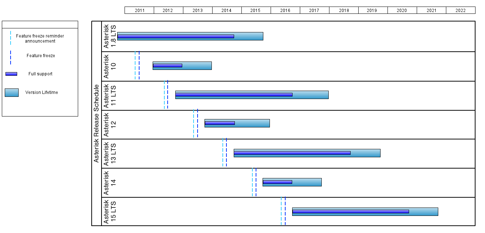

# About the Project
## A Brief History of the Asterisk Project
### Linux Support Services
Way, way back in 1999 a young man named Mark Spencer was finishing his Computer Engineering degree at Auburn University when he hit on
an interesting business concept.  1999 was the high point in the .com revolution (aka bubble), and thousands of businesses world-wide were discovering
that they could save money by using the open source Linux operating system in place of proprietary operating systems.  The lure of a free operating
system with open access to the source code was too much to pass up.  Unfortunately there was little in the way of commercial support available for Linux
at that time.  Mark decided to fill this gap by creating a company called "Linux Support Services".  LSS offered a support hotline that IT professionals could
(for a fee) call to get help with Linux.
The idea took off.  Within a few months, Mark had a small office staffed with Linux experts.  Within a few more months the growth of the business expanded
demanded a "real" phone system that could distribute calls evenly across the support team, so Mark called up several local phone system vendors and
asked for quotes.  Much to his surprise, the responses all came back well above $50,000 -- far more than Mark had budgeted for the project.  Far more
than LSS could afford.
### Finding a Solution
Rather than give in and take out a small business loan, Mark made a pivotal decision.  He decided to write his own phone system.  Why not?  A phone
system is really just a computer running phone software, right?  Fortunately for us, Mark had no idea how big a project he had take on.  If he had known
what a massive undertaking it was to build a phone system from the ground up might have gritted his teeth, borrowed the money and spent the next
decade doing Linux support.  But he didn't know what he didn't know, and so he started to code.  And he coded.  And he coded.
Mark had done his engineering co-op at Adtran, a communications and networking device manufacturer in Huntsville, AL.  There he had cut his teeth on
telecommunications system development, solving difficult problems generating a prodigious amount of complex code in short time.  This experience proved
invaluable as he began to frame out the system which grew into Asterisk.  In only a few months Mark crafted the original Asterisk core code.  As soon as he
had a working prototype he published the source code on the Internet, making it available under the GPL license (the same license used for Linux).
Within a few months the idea of an "open source PBX" caught on.  There had been a few other open source communications projects, but none had
captured the imagination of the global population of communications geeks like Asterisk.  As Mark labored on the core system, hundreds (now thousands)
of developers from all over the world began to submit new features and functions.
### Digium
What became of Linux Support Services? In 2001, Linux Support Services changed its name to Digium. Digium continued to develop Asterisk in
collaboration with the community, provide services to support the development community, as well as build commercial products and services around
Asterisk which have fueled growth in both Digium and the Asterisk project. You can find out more about Digium at Digium's website and on wikipedia.
### Asterisk in the Present
Asterisk is constantly evolving to meet the needs of the project's user-base. It's difficult to summarize the vast scope of everything that Asterisk can do as a
communications toolkit. We'll list some resources that give you an idea of what is going on in the Asterisk project at present.
* Asterisk Versions :Shows release time lines, support and EOL schedules
* Roadmap section :Information from developer conferences and planning sessions
* CHANGES :A document in Asterisk trunk, shows functionality changes between major versions
* UPGRADE :A document in Asterisk trunk, shows breaking changes, deprecation of specific features and important info on upgrading.
* Mailing lists :The dev list is a great list to see what hot topics the developers are discussing in real-time.

## Asterisk as a Swiss Army Knife of Telephony
### What Is Asterisk?
People often tend to think of Asterisk as an "open source PBX" because that was the focus of the original development effort.  But calling Asterisk a PBX is
both selling it short (it is much more) and overstating it (it can be much less).  It is true that Asterisk started out as a phone system for a small business (see
the "Brief History" section for the juicy details) but in the decade since it was originally released it has grown into a universal tool for building
communications applications.  Today Asterisk powers not only IP PBX systems but also VoIP gateways, call center systems, conference bridges, voicemail
servers and all kinds of other applications that involve real-time communications.
Asterisk is not a PBX but is the engine that powers PBXs.  Asterisk is not an IVR but is the engine that powers IVRs.  Asterisk is not a call center ACD but
is the engine that powers ACD/queueing systems.
Asterisk is to communications applications what the Apache web server is to web applications.  Apache is a web server.  Asterisk is a communication
server.  Apache handles all the low-level details of sending and receiving data using the HTTP protocol.  Asterisk handles all the low level details of sending
and receiving data using lots of different communication protocols.  When you install Apache, you have a web server but its up to you to create the web
applications.  When you install Asterisk, you have a communications server but its up to you to create the communications applications.
Web applications are built out of HTML pages, CSS style sheets, server-side processing scripts, images, databases, web services, etc.  Asterisk
communications applications are built out Dialplan scripts, configuration files, audio recordings, databases, web services, etc.  For a web application to
work, you need the web server connected to the Internet.  For a communications application to work, you need the communications server connected to
communication services (VoIP or PSTN).  For people to be able to access your web site you need to register a domain name and set up DNS entries that
point "www.yourdomain.com" to your server.  For people to access your communications system you need phone numbers or VoIP URIs that send calls to
your server.
In both cases the server is the plumbing that makes your application work.  The server handles the low-level complexities and allows you, the application
developer, to concentrate on the application logic and presentation.  You don't have to be an expert on HTTP to create powerful web applications, and you
don't have to be an expert on SIP or Q.931 to create powerful communications applications.
Here's a simple example.  The following HTML script, installed on a working web server, prints "Hello World" in large type:
```
<html>
  <head>
    <title>Hello World Demo</title>
  </head>
  <body>
    <h1>Hello World!</h1>
  </body>
</html>
```
The following Dialplan script answers the phone, waits for one second, plays back "hello world" then hangs up.
```
exten => 100,1,Answer()
exten => 100,n,Wait(1)
exten => 100,n,Playback(hello-world)
exten => 100,n,Hangup()
```
In both cases the server components are handling all of the low level details of the underlying protocols.  Your application doesn't have to worry about the
byte alignment, the packet size, the codec or any of the thousands of other critical details that make the application work.  This is the power of an engine.
Who Uses Asterisk?
Asterisk is created by communication system developers, for communication system developers.  As an open source project, Asterisk is a collaboration
between many different individuals and companies, all of which need a flexible communications engine to power their applications.

## Asterisk Versions
There are multiple supported feature frozen releases of Asterisk. Once a release series is made available, it is supported for some period of time. During
this initial support period, releases include changes to fix bugs that have been reported. At some point, the release series will be deprecated and only
maintained with fixes for security issues. Finally, the release will reach its End of Life, where it will no longer receive changes of any kind.
The type of release defines how long it will be supported. A Long Term Support (LTS) release will be fully supported for 4 years, with one additional year of
maintenance for security fixes. Standard releases are supported for a shorter period of time, which will be at least one year of full support and an additional
year of maintenance for security fixes.
The following table shows the release time lines for all releases of Asterisk, including those that have reached End of Life.
Release Series Release Type Release Date Security Fix Only EOL
1.2.X 2005-11-21 2007-08-07 2010-11-21
1.4.X LTS 2006-12-23 2011-04-21 2012-04-21
1.6.0.X Standard 2008-10-01 2010-05-01 2010-10-01
1.6.1.X Standard 2009-04-27 2010-05-01 2011-04-27
1.6.2.X Standard 2009-12-18 2011-04-21 2012-04-21
1.8.X LTS 2010-10-21 2014-10-21 2015-10-21
10.X Standard 2011-12-15 2012-12-15 2013-12-15
11.x LTS 2012-10-25 2016-10-25 2017-10-25
12.x Standard 2013-12-20 2014-12-20 2015-12-20
13.x LTS 2014-10-24 2018-10-24 2019-10-24
14.x Standard 2016-10 (tentative) 2017-10 (tentative) 2018-10 (tentative)
15.x LTS 2017-10 (tentative) 2021-10 (tentative) 2022-10 (tentative)
New releases of Asterisk will be made roughly once a year, alternating between standard and LTS releases. Within a given release series that is fully
supported, bug fix updates are provided roughly every 4 weeks. For a release series that is receiving only maintenance for security fixes, updates are made
on an as needed basis.
If you're not sure which one to use, choose either the latest release for the most up to date features, or the latest LTS release for a platform that may have
less features, but will usually be around longer.
The schedule for Asterisk releases is visualized below (which is subject to change at any time):



For developers, it is useful to be aware of when the feature freeze for a particular branch will occur. The feature freeze for a branch will occur 3 months
prior to the release of a new Asterisk version, and a reminder announcement will be posted to the asterisk-dev mailing list approximately 60 days prior to
the feature freeze. Asterisk versions are slated to be released the 3rd Wednesday of October. The feature freeze for a branch will occur the 3rd
Wednesday of July. An announcement reminder will be posted to the asterisk-dev mailing list the 3rd Wednesday of May. Feature freeze consists of the
creation of two branches: One for the release series and one for the initial release. Features can continue to be placed into the release series branch
according to policy but the initial release branch will be frozen.

Feature Freeze Announcement Reminder 3rd Wednesday of May
Feature Freeze of Asterisk Branch 3rd Wednesday of July
First Release of Asterisk from Branch 3rd Wednesday of October

## License Information
Asterisk License Information
Asterisk Sounds
Frequently Asked Questions about Licensing
What is an open-source license?
What is the GNU General Public License?
What if I want to distribute or license Asterisk under a different license?
How can I contribute to Asterisk?
### Asterisk License Information
Asterisk is distributed under the GNU General Public License version 2 and is also available under alternative licenses negotiated directly with Digium, Inc.
If you obtained Asterisk under the GPL, then the GPL applies to all loadable Asterisk modules used on your system as well, except as defined below. The
GPL (version 2) is included in this source tree in the file COPYING.
This package also includes various components that are not part of Asterisk itself; these components are in the 'contrib' directory and its subdirectories.
These components are also distributed under the GPL version 2 as well.
Digium, Inc. (formerly Linux Support Services) holds copyright and/or sufficient licenses to all components of the Asterisk package, and therefore can grant,
at its sole discretion, the ability for companies, individuals, or organizations to create proprietary or Open Source (even if not GPL) modules which may be
dynamically linked at runtime with the portions of Asterisk which fall under our copyright/license umbrella, or are distributed under more flexible licenses
than GPL.
If you wish to use our code in other GPL programs, don't worry -- there is no requirement that you provide the same exception in your GPL'd products
(although if you've written a module for Asterisk we would strongly encourage you to make the same exception that we do).
Specific permission is also granted to link Asterisk with OpenSSL, OpenH323 and/or the UW IMAP Toolkit and distribute the resulting binary files.
In addition, Asterisk implements several management/control protocols. This includes the Asterisk Manager Interface (AMI), the Asterisk Gateway Interface
(AGI), and the Asterisk REST Interface (ARI). It is our belief that applications using these protocols to manage or control an Asterisk instance do not have
to be licensed under the GPL or a compatible license, as we believe these protocols do not create a 'derivative work' as referred to in the GPL. However,
should any court or other judiciary body find that these protocols do fall under the terms of the GPL, then we hereby grant you a license to use these
protocols in combination with Asterisk in external applications licensed under any license you wish.
The 'Asterisk' name and logos are trademarks owned by Digium, Inc., and use of them is subject to our trademark licensing policies. If you wish to use
these trademarks for purposes other than simple redistribution of Asterisk source code obtained from Digium, you should contact our licensing department
to determine the necessary steps you must take. For more information on this policy, please read: http://www.digium.com/en/company/profile/trademarkpoli
cy.php
If you have any questions regarding our licensing policy, please contact us:
+1.877.344.4861 (via telephone in the USA)
+1.256.428.6000 (via telephone outside the USA)
+1.256.864.0464 (via FAX inside or outside the USA)
IAX2/pbx.digium.com (via IAX2)
licensing@digium.com (via email)
Digium, Inc.
445 Jan Davis Drive NW
Huntsville, AL 35806
United States
#### Asterisk Sounds
License information for Asterisk sounds can be found in the Voice Prompts and Music on Hold License section.
### Frequently Asked Questions about Licensing
What is an open-source license?
Wikipedia has a great article on open-source licenses, and opensource.org is a pretty definitive resource.
What is the GNU General Public License?
The GPL is a specific open-source license. Reading the preamble at this link is a great introduction, and below that is the full license text.
What if I want to distribute or license Asterisk under a different license?
Digium distributes Asterisk under a multi-licensing model often referred to as Dual-licensing and is additionally made possible by a Contributors License
Agreement. This allows Digium to provide Asterisk under licenses other than the GPL. Digium provides information on their alternative commercial licensingContent is licensed under a Creative Commons Attribution-ShareAlike 3.0 United States License. 11
at their website.
How can I contribute to Asterisk?
Documentation, new features, bug fixes, testing, protocol and programming expertise,, and general feedback are all welcome to the project. There is an ov
erview that points to many resources for developers, also you can see the guidelines for contribution to see how it works.
