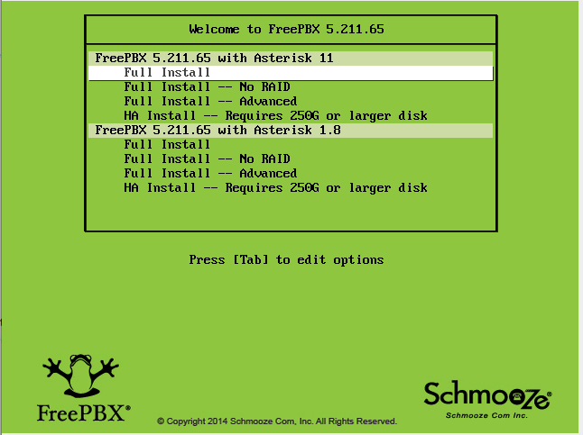

# Getting Started
When learning Asterisk it is important to start off on the right foot, so this section of the wiki covers orientation for learning Asterisk as well as installation
and a simple Hello World style tutorial. These items are foundational, as knowing how to install Asterisk right the first time and where to locate the right help
resources will save you a ton of time down the road.
Those interested in Asterisk training courses and certifications may visit http://www.asterisk.org/products/training

## Beginning Asterisk
### Asterisk is…
* an Open Source software development project
* written in the C Programming Language
* running on Linux (or other types of Unix )
* powering Business Telephone Systems
* connecting many different Telephony protocols
* a toolkit for building many things:
  - an IP PBX with many powerful features and applications
  - VoIP Gateways
  - Conferencing systems
  - and much, much more
* supporting VoIP Phones as well as PSTN and POTS
* speaking SIP , the most common VoIP protocol, among others

### YouTube Videos

* Systm 5 Episode on Asterisk (from 2006 - see Asterisk Wiki for current installation instructions)
* Official Asterisk Channel
* Asterisk 123: Intro to Asterisk from Astricon 10
* Asterisk 12 Overview from Astricon 10

### Resources for understanding

* Acronyms and Terminology
  - Telephony Terminology
  - Asterisk Terms Glossary
  - Telecom Acronyms (very comprehensive)
* Telephony Protocols
  - IP Telephony Protocols Overview
  - SIP Overview
  - A Hitchhiker's Guide to SIP
* Linux & Unix
  - Linux Newbie Guide
  - Beginner Tutorials
  - Unix Beginner Tutorial
* Installing and Configuring Asterisk
  - Asterisk: The Definitive Guide 3rd Edition
  - The Asterisk Wiki
* C Programming
  - C Programming Tutorial
  - Interactive C Tutorial
  - C Programming Quick Guide

### Where to get help

Email Lists and Live Chat (IRC)
Asterisk Mailing List and IRC
Web Discussion Forums
Asterisk Community Forums
Online Community
Voip Users Conference main site and on Google+
Avoiding obsolete or incorrect information
When reading about Asterisk on the web, you may come across old or incorrect information.
Check which version of Asterisk is mentioned.  There are significant changes in every version.
Check the published date of the article if the Asterisk version isn’t provided.
Take things with a grain of salt until checked with another resource or proven correct through your own testing.
Refer to the Asterisk Wiki and the Official Asterisk Youtube Channel for the most accurate and up to date details on the specific version of Asterisk
you are using.
Please note that it is always possible that even the official documentation does not match what is written into the source code itself.  If you find something
lacking or incorrect in the Asterisk documentation, please communicate it through comments on the Asterisk Wiki or by filing an issue through the Asterisk
Issues Tracker .

## Installing Asterisk
Now that you know a bit about Asterisk and how it is used, it's time to get you up and running with your own Asterisk installation. There are various ways to get started with Asterisk on your own system:
* Install an Asterisk-based Linux distribution such as AsteriskNOW. This takes care of installing Linux, Asterisk, and some web-based interfaces all at the same time, and is the easiest way to get started if you're new to Linux and/or Asterisk.
* If you're already familiar with Linux or Unix, you can simply install packages for Asterisk and its related tools using the package manager in your operating system. We'll cover this in more detail below in Alternate Install Methods.
* For the utmost in control of your installation, you can compile and install Asterisk (and its related tools) from source code. We'll explain
how to do this in Installing Asterisk From Source.

### Installing AsteriskNOW

Installing AsteriskNOW Official Distro

The simplest way to install AsteriskNOW is to follow these instructions:
1. Download the ISO file from  http://asterisk.org/downloads/asterisknow .
2. Burn the ISO file to a DVD or CD.  If you need help doing this, simply Google "burn ISO to DVD" and you'll find plenty of instructions OR click
this link so I can Google it for you: "Google burn ISO to DVD" .
3. Select a computer to install AsteriskNOW . EVERYTHING ON THIS COMPUTER WILL BE DELETED AND REPLACED WITH THE AsteriskNOW
DISTRO.   Configure the computer to boot from a DVD or CD. Insert the DVD or CD into the computer and turn it on. NOTE: You must be
connected to the internet to run the installer . If you're installing using a USB drive, you may encounter a "kickstart" error while installing. If you
do, don't fret! Just keep hitting enter when the prompts appear and everything will probably work just fine.
4. The installer will begin with a prompt to select the Asterisk Version you wish to install.

5. The system will present you with a window showing that it is retrieving images while it downloads the install package from the internet. This should take 3-5 minutes.

6. After the system boots you will see options to configure your network. The default selections are fine in most cases, so just press TAB until the red "OK" box is highlighted in white and then press ENTER. You can also choose the option to manually configure your network connections, if desired.

Once you hit “OK” the system will configure your Network Connections.

7. Eventually, you will reach the "Time Zone Selection" screen. If your system clock uses GMT (most do not), hit space. Then, hit TAB to move to the time zone selection area. Use the up and down arrows to select the time zone where you will use the system, and then hit TAB until the red "OK" button is highlighted in white. Then, hit ENTER.

8. The installer will ask you to to select your root password. The root password is the password you'll use to login to the Linux command prompt later. Selecting a secure password is very important. Type the password, hit TAB, type it again, hit TAB, and then hit ENTER.

9. The installer will do a dependency check, format your hard drive, and then start the package installation process. There may be a significant delay before the installation actually starts, so be patient. Eventually, the installation will show you a progress bar indicating the percentage completed and the time elapsed/remaining. That process should take between 20 and 30 minutes, it will then reboot.

10. A few additional packages will be installed and updated after the reboot from the install.  This can take 10-15 minutes.

11.  Once completed you'll reach the Linux console/command prompt login. You can login here using the username "root" without quotes, and the root password you selected earlier.

12. After you login, you should see the IP address of your PBX as defined below.

13. Go to another computer on the same network and enter that IP address into your web browser. The first time you do so you'll be asked to create the admin username and the admin password. This username and password will be used in the future to access the FreePBX configuration screen. Note: These passwords do not change the root password! They are only used for access to the  web GUI interface.

  14. The main FreePBX screen will offer you four options:

    PBX Administrator - allows you to configure your PBX. Use the admin username and admin password you configured in the step above to login. This section is what most people refer to as "FreePBX."

    User Control Panel

    Operator Panel - screen that allows an operator to control calls

    Official FreePBX Support:

15. You have now successfully installed AsteriskNOW with FreePBX GUI.

Need additional assistance?

There is an active community of AsteriskNOW users, integrators, and developers, who provide community support on the AsteriskNOW forums.

GUI support is provided by FreePBX.  Please visit the FreePBX wiki for additional help by clicking here.

Digium also offers a complete line of cloud and hardware products to complete your AsteriskNOW solution.  These products give you a way to connect to the PSTN so you can start using AsteriskNOW.  These include:

    SIP Trunking
    Telephony Cards for analog, digital, and BRI PSTN connectivity
    Asterisk IP Phones
    VoIP Gateways
    Asterisk Training

Digium is the Gold Standard in Asterisk Hardware

Digium is the leading manufacturer of analog and digital interface cards, voice compression modules, redundancy solutions, and IP media gateways for use with the Asterisk open source communications engine.  Digium is also the developer and maintainer of Asterisk.  Asterisk is the free and open source communications engine that AsteriskNOW is built on.

When you purchase Digium products, not only are you getting the best products in the industry, you are also contributing and supporting the free Asterisk open source project!  Thanks for your support!
